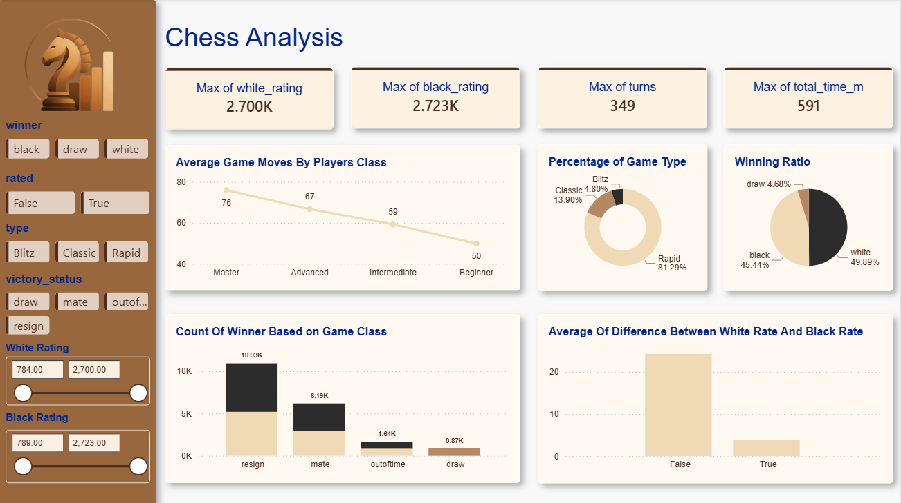
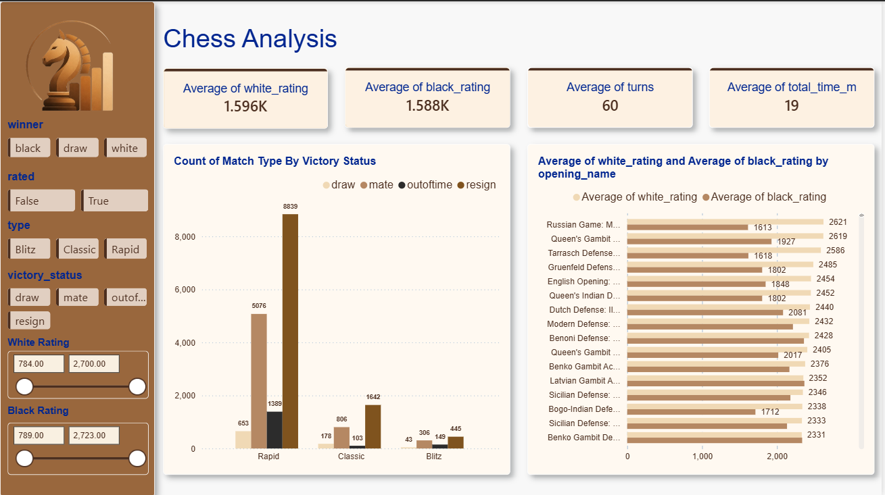
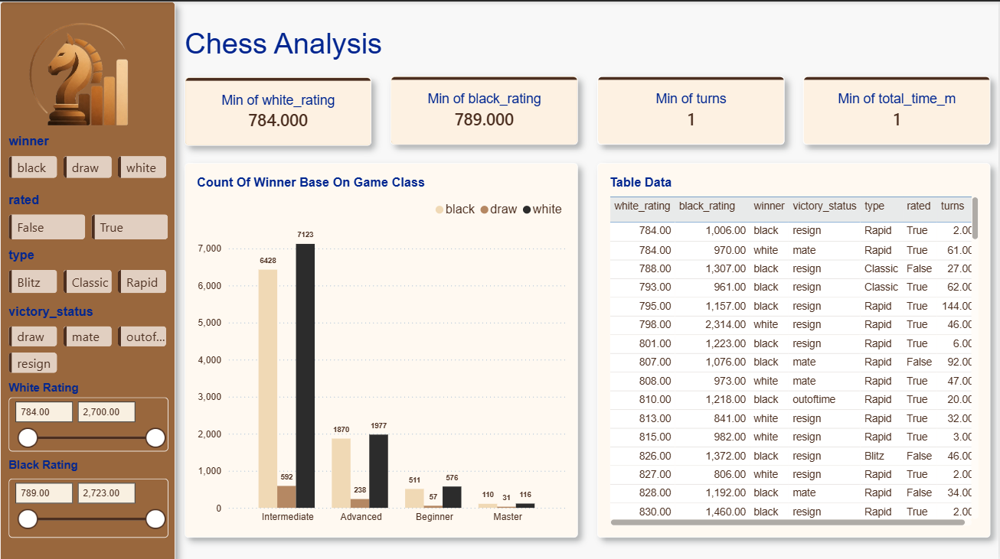

<div align="center">
  
</div>

# Chess Power BI Dashboard

## Overview
The **Chess Power BI Dashboard** is a comprehensive data analysis and visualization project designed to explore and analyze chess game datasets. This project transforms raw game logs into actionable insights, utilizing a custom JSON theme for a sleek, professional interface. 

The analytical pipeline includes robust data preprocessing with Python (Pandas) to clean, aggregate, and calculate key metrics such as total game times, player performance, and opening strategies.

## Features
- **Interactive Visualizations**: Dive deep into player stats, opening success rates, and game outcomes.
- **Custom Theming**: Features a polished UI using a custom `ChessTheme.json` for a consistent, professional look.
- **Data Preprocessing Pipeline**: Includes Jupyter notebooks detailing the data cleaning process, handling missing values, and engineering new features (e.g., total match time based on increment codes).

## Screenshots
<div align="center">
  
  
  
</div>

## Project Structure
- `Chess Dashboard.pbix` - The core Power BI dashboard file containing the reports and data model.
- `ChessTheme.json` - The custom theme applied to the Power BI dashboard.
- `Dataset/` - Contains the raw and cleaned datasets (`games.csv`, `cleaned_games.csv`).
- `Notebooks/` - Contains the Python Jupyter Notebook (`code.ipynb`) used for data extraction, cleaning, and preprocessing.
- `Images/` - Contains screenshots and visual assets of the dashboard.

## Prerequisites
- **Power BI Desktop**: Required to open and interact with the `.pbix` file.
- **Python 3.x**: Required to run the data preprocessing scripts (optional if you just want to view the dashboard).
- **Jupyter Notebook**: For exploring the data cleaning pipeline.

## Getting Started
1. **Clone the Repository**:
   ```bash
   git clone https://github.com/Mostafa-El-gelany/Chess-Power-BI-Dashboard-.git
   ```
2. **Explore the Data**: Navigate to the `Notebooks` folder to see how the raw dataset was preprocessed using Pandas.
3. **Open the Dashboard**: Open `Chess Dashboard.pbix` in Power BI Desktop to interact with the visualizations.

## Team
This project was developed collaboratively by the following team members:

<div align="center">
  <table>
    <tr>
      <td align="center"><a href="https://github.com/ahmednashatnoaman-svg"><br /><sub><b>Ahmed Nashat Noaman</b></sub></a></td>
      <td align="center"><a href="https://github.com/Mostafa-El-gelany"><br /><sub><b>Mostafa El-Gelany</b></sub></a></td>
      <td align="center"><a href="https://github.com/ahmed-m-sharaf"><br /><sub><b>Ahmed Sharaf</b></sub></a></td>
    </tr>
  </table>
</div>

---
*Built with passion for data and chess.*